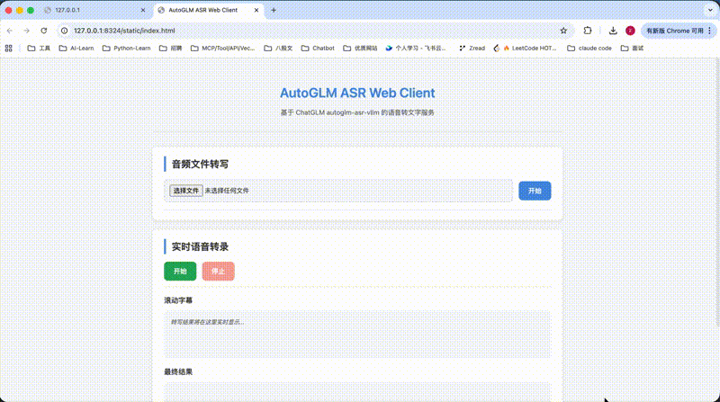

# AutoGLM ASR Web Client

> 将 `autoglm-asr-vllm` 单次音频处理模型封装为端到端 Web Client。支持音频文件转写 + 浏览器麦克风实时转录，实时能力基于**滑动窗口 + VAD + partial/final 状态机**模拟实现。

## 功能演示



---

## 技术选型

| 层 | 技术 |
|---|---|
| 前端 | HTML5 + CSS3 + 原生 JS |
| 后端 | Python 3.12+ / FastAPI |
| HTTP | httpx (async) |
| 音频编码 | 前端手写 WAV / 后端 pydub |
| 配置     | python-dotenv + 本地密钥文件 |

---

## 系统架构

```
┌─────────────────────────────────────────────────────────┐
│  浏览器 (static/)                                        │
│  ┌──────────┐  ┌──────────────┐  ┌──────────────────┐   │
│  │ 文件上传  │  │ Web Audio API │  │ 滚动字幕          │   │
│  │          │  │ → PCM 16kHz  │  │ partial → final   │   │
│  └────┬─────┘  └──────┬───────┘  └────────┬─────────┘   │
│       │               │                    ▲            │
│       │    ┌──────────┴───────┐            │            │
│       │    │ VAD + 滑动窗口    │────────────┘            │
│       │    │ 3s 窗口/1.5s 重叠 │  merged_text            │
│       │    └────────┬─────────┘                         │
└───────┼─────────────┼───────────────────────────────────┘
        │             │  multipart/form-data
        ▼             ▼
┌─────────────────────────────────────────────────────────┐
│  FastAPI (app/)                                          │
│  ┌───────────────────┐  ┌───────────────────────────┐   │
│  │ /api/transcribe/  │  │ services/                  │   │
│  │  file             │  │ asr_client    (API 调用)    │   │
│  │  session          │  │ session_store (会话管理)    │   │
│  │  chunk            │  │ transcript_merge (去重合并) │   │
│  │  finalize         │  │                            │   │
│  └────────┬──────────┘  └─────────────┬─────────────┘   │
└───────────┼─────────────────────────────┼─────────────────┘
            │                             │
            ▼               Bearer Token  │
┌─────────────────────────────────────────┐ │
│  ChatGLM API                            │ │
│  POST /v1/chat/completions ◄────────────┘
│  model: autoglm-asr-vllm                │
└─────────────────────────────────────────┘
```

---

## 项目结构

```
ASR/
├── app/
│   ├── main.py                   # FastAPI 入口 + /health
│   ├── config.py                 # 配置集中管理 (API Key/超时/VAD/窗口参数)
│   ├── routers/
│   │   └── transcribe.py         # 4 个端点: file / session / chunk / finalize
│   ├── services/
│   │   ├── asr_client.py         # ChatGLM ASR 请求构造 & 响应解析
│   │   ├── session_store.py      # 线程安全内存会话 + 自动过期清理
│   │   └── transcript_merge.py   # chunk 尾首重叠去重拼接
│   └── utils/
│       └── audio.py              # 格式检测 / Data URL 编码 / pydub 转码
├── static/
│   ├── index.html                # 单页界面
│   ├── app.js                    # 前端核心 (~600 行): VAD + 滑动窗口 + WAV编码
│   └── style.css
└── pyproject.toml
```

---

## 核心逻辑图解

### 一图看懂实时转录全链路

```
 麦克风
   │
   ▼
 getUserMedia()
   │
   ▼
 AudioContext (16kHz 单声道)
   │
   ▼
 ScriptProcessor (4096 samples/buffer)
   │
   ▼  onaudioprocess 逐帧回调
   │
   ├──► RMS 能量计算 ──► VAD 三状态机 ─────────────┐
   │         │                                      │
   │    ┌────┴────┐                                 │
   │    │  IDLE   │── energy≥0.01 ──► SPEECH       │
   │    │         │◄── 太短<300ms ────              │
   │    └─────────┘                                 │
   │         ▲                                      │
   │    ┌────┴────┐                                 │
   │    │  SPEECH │── 15帧静音(750ms)               │
   │    │         │   + 时长≥300ms ──► SILENCE ─────┤
   │    └─────────┘                                 │
   │         │                                      │
   │    ┌────┴────┐                                 │
   │    │ SILENCE │── 检测到语音 ──► SPEECH ────────┤
   │    └─────────┘                                 │
   │                                                │
   │   SlidingWindowBuffer ◄────────────────────────┘
   │         │ 累积 Float32 样本
   │         │
   │    ┌────┴────┐
   │    │ 缓冲≥3s? │── No ──► 继续积累
   │    └────┬────┘
   │         │ Yes
   │         ▼
   │    getSendWindow() ──────┐
   │    取末尾 3s 样本        │
   │    保留末尾 1.5s 为重叠   │ 滑动窗口示意:
   │                          │
   │         ◄────────────────┘   [0s    1.5s    3s    4.5s    6s]
   │                                   ├──────┼──────┤  chunk0
   │                                      ├──────┼──────┤  chunk1
   │                                         ├──────┼──────┤  chunk2
   │                                             50% overlap
   │
   ▼
 encodeWav()  手写 WAV 编码 (44B header + 16-bit PCM)
   │
   ▼
 processNextChunk()  Promise chain 顺序上传
   │
   ▼  POST /api/transcribe/chunk
   │  { session_id, chunk_index, file (WAV), window_size_ms, overlap_ms }
   │
   ▼  FastAPI transcribe.py
   │
   ├──► detect_audio_format() → 非WAV? → pydub 转 WAV
   ├──► encode_audio_to_data_url() → data:audio/wav;base64,...
   ├──► ASRClient.transcribe()
   │    │
   │    ▼  POST https://api.chatglm.cn/v1/chat/completions
   │    │  Authorization: Bearer <KEY>
   │    │  {
   │    │    "model": "autoglm-asr-vllm",
   │    │    "messages": [
   │    │      {"role":"system","content":"你是一个名为ChatGLM的人工智能助手。"},
   │    │      {"role":"user","content":[
   │    │        {"type":"text","text":"<|begin_of_audio|><|endoftext|><|end_of_audio|>"},
   │    │        {"type":"audio_url","audio_url":{"url":"data:audio/wav;base64,..."}},
   │    │        {"type":"text","text":"将这段音频转录成文字。"}
   │    │      ]}
   │    │    ]
   │    │  }
   │    │
   │    ▼  提取 response.choices[0].message.content
   │    │
   ├──► session_store.add_chunk()
   ├──► transcript_merge.merge_chunks()  ← 尾首重叠去重
   │
   ▼  返回 { partial_text, merged_text }
   │
   ▼  前端 appendToLiveTranscript(merged_text)  → 滚动字幕实时更新
   │
   ...  重复直到用户点"停止" ...
   │
   ▼  POST /api/transcribe/finalize
   │
   ▼  final_text → 最终结果展示 + 导出 .txt
   │
   会话删除
```

### VAD 状态机

```
                    energy ≥ 0.01
         ┌──────────┐
    ┌───►│  SPEECH  │◄──────────────┐
    │    └─────┬────┘               │
    │          │                    │
    │          │ 15 帧静音 + ≥300ms │ 检测到语音
    │          ▼                    │
    │    ┌──────────┐               │
    │    │ SILENCE  │───────────────┘
    │    └──────────┘
    │
    │    太短 (< 300ms)    ┌──────────┐
    └─────────────────────│   IDLE   │
                          └──────────┘
```

### Chunk 去重示意

```
  chunk1: "今天我们来讲一下语音识别"
  chunk2: "讲一下语音识别的基本流程"
           ├────────────────┤  重叠 = "讲一下语音识别" (7字)
  合并:   "今天我们来讲一下语音识别的基本流程"
```

### 前端 UI 状态机

```
  idle ──[开始]──► recording ──[停止]──► processing ──► done
                      │                        │
                      └────────────────────────┘
                             异常 → error
```

---

## API 接口

| 端点 | 方法 | 用途 |
|---|---|---|
| `/api/transcribe/file` | POST | 上传音频文件，返回完整转写 |
| `/api/transcribe/session` | POST | 创建实时语音转录会话，返回 UUID |
| `/api/transcribe/chunk` | POST | 上传单个音频片段，返回 partial + merged |
| `/api/transcribe/finalize` | POST | 结束会话，返回最终文本并清理 |
| `/health` | GET | 健康检查 |

### `POST /api/transcribe/file`

```
请求: multipart/form-data { file, prompt? }
响应: { success, data: { transcript, format } }
```

### `POST /api/transcribe/chunk`

```
请求: multipart/form-data { session_id, chunk_index, file, mime_type, window_size_ms, overlap_ms }
响应: { success, data: { chunk_index, partial_text, merged_text } }
```

### `POST /api/transcribe/finalize`

```
请求: multipart/form-data { session_id }
响应: { success, data: { final_text } }
```

---

## 启动与测试

```bash
# 安装依赖
pip install -e .

# 启动
uvicorn app.main:app --reload --port 8323
# 浏览器打开 http://localhost:8323

# 命令行测试
curl http://localhost:8323/health
curl -X POST "http://localhost:8323/api/transcribe/file" -F "file=@test.wav"
```

## API Key 配置

两种方式（优先级从高到低），均只在服务端生效：

```bash
# 方式 1: 环境变量
export CHATGLM_API_KEY="your_key"

# 方式 2: 项目根目录 glm_api_key 文件
echo 'your_key' > glm_api_key
```

---

## 错误码

| 错误码 | 分类 | 含义 |
|---|---|---|
| `CONFIG_ERROR` | 配置 | API Key 未配置 |
| `EMPTY_AUDIO_FILE` | 输入 | 文件为空 |
| `UNSUPPORTED_AUDIO_FORMAT` | 输入 | 格式不支持 |
| `AUDIO_CONVERT_ERROR` | 处理 | 非 WAV 转码失败 (需 pydub) |
| `AUDIO_ENCODE_ERROR` | 处理 | Base64 编码失败 |
| `ASR_AUTH_FAILED` | 上游 | 鉴权 401/403 |
| `ASR_TIMEOUT` | 上游 | 上游超时 (120s) |
| `ASR_REQUEST_FAILED` | 上游 | 上游请求异常 |
| `SESSION_NOT_FOUND` | 状态 | 会话过期或已结束 |
| `FILE_READ_ERROR` | 输入 | 文件读取失败 |

---

## 已知问题与设计权衡

| 问题 | 原因 | 权衡 |
|---|---|---|
| Chunk 级延迟 (非 token 级) | 接口是单次请求-响应，非原生流式 | 当前接口能力边界内的工程选择，非实现缺陷 |
| Chunk 边界可能残留重复/过删 | `_find_overlap()` 贪心最长匹配，同音词不完美 | 90% 场景可去重，极端 case 待优化 |
| VAD 固定阈值在噪声环境不准 | 阈值 0.01 不会自适应 | 后续可加动态噪声底板计算 |
| ScriptProcessor 已 deprecated | W3C 不再推荐 | 后续迁移 AudioWorklet |
| 会话内存存储重启丢失 | 内存字典，非持久化 | 演示场景够用，生产需 Redis |

---

## VAD 技术详解

### 传统 VAD 常用方法

#### 1. 能量检测 (Energy-based)
```python
# 最简单：计算短时能量
energy = sum(x[n]**2 for n in range(N)) / N
is_speech = energy > threshold  # 阈值通常0.01或自适应
```

#### 2. 频谱特征 (Spectral)
- **过零率 (ZCR)**：语音高频多，静音低
```python
zcr = sum(abs(sign(x[n]) - sign(x[n-1]))) / N
```
- **频谱质心/带宽**：语音有特定频谱特征

#### 3. 滤波器法
- **带通滤波**：保留300Hz~3400Hz（语音频段）
- **WebRTC VAD**：用GMM(高斯混合模型)判断

#### 4. 深度学习法
- **Silero VAD**：预训练模型，精度高
```python
# pip install silero-vad
from silero_vad import load_silero_vad
vad = load_silero_vad()
speech_probs = vad(audio, sample_rate=16000)
```

#### 5. 自适应阈值
- 根据环境噪声动态调整阈值
```python
noise_floor = 0.95 * noise_floor + 0.05 * current_energy
threshold = noise_floor * 2  # 动态阈值
```

### 本项目 VAD 实现

本项目采用**纯前端自闭环方案**，核心分三块：

#### 1. 能量计算
每一帧 PCM 音频计算 RMS 均方根能量：
```javascript
let energy = 0;
for (let i = 0; i < samples.length; i++) {
    energy += samples[i] * samples[i];
}
energy = Math.sqrt(energy / samples.length);
const isSpeech = energy >= 0.01;  // 阈值0.01
```
每帧 4096 样本，16kHz 下约 256 毫秒。

#### 2. 三状态机
```
         energy ≥ 0.01
    ┌──────────┐
───►│   IDLE   │──── 太短<300ms ────► 丢弃
    └────┬─────┘
         │ energy ≥ 0.01
         ▼
    ┌──────────┐
───►│  SPEECH  │◄── 检测到语音 ────────┐
    └────┬─────┘                        │
         │ 15帧静音 + ≥300ms            │
         ▼                              │
    ┌──────────┐                        │
    │  SILENCE │──── 检测到语音 ────────┘
    └──────────┘
```

关键参数：
- 能量阈值：0.01
- 连续15帧静音判结束（约750ms）
- 最短有效语音300ms，避免误触发

#### 3. 滑动窗口配合
音频帧持续往缓冲推送，仅两种情况发送数据：
- 缓冲攒够3秒
- 语音状态切换到静音状态（说话结束）

### 方案对比

| 方案 | 优势 | 劣势 |
|------|------|------|
| 本项目 | 零依赖、无延迟、前端自闭环 | 固定阈值，复杂噪声环境效果差 |
| Silero VAD | 精度高、自适应 | 需加载模型、有推理延迟 |
| WebRTC VAD | 工业级、成熟 | 依赖库、参数调优复杂 |
| 自适应能量 | 简单、实时性好 | 需要噪声样本初始化 |

---

## 后续优化方向

```
短期 (立即可做)         中期 (需工作量)          长期 (生产化)
├─ 前端暴漏 prompt 输入   ├─ AudioWorklet          ├─ WebSocket 流式
├─ 自适应 VAD 阈值       ├─ 编辑距离去重          ├─ Redis 会话持久化
├─ 请求重试机制           ├─ ffmpeg 转码增强       ├─ 降噪/AGC 前处理
└─ 跳过 pydub (WAV直传)  └─ SRT 字幕时间戳        └─ 批量文件/文件夹
```

---

## 加分项

| 加分项 | 状态 | 实现 |
|---|---|---|
| 字幕式滚动展示 | ✓ | `appendToLiveTranscript()` 自动滚动 + CSS 脉冲动画 |
| VAD 静音检测 | ✓ | RMS 能量 + IDLE/SPEECH/SILENCE 三状态机 |
| 结果导出 | ✓ | 音频文件转写 & 实时语音转录均可导出 .txt |
| Chunk 去重拼接 | ✓ | `_find_overlap()` 尾首最长公共子串 |
| 热词/场景提示词 | 半 | 后端支持 `prompt` 参数，前端待暴露输入框 |
| 请求重试 | ✗ | 后续优化 |

---

## 技术假设

- ASR 模型仅接受 WAV；前端采集 16kHz 单声道 PCM
- 首块延迟 ≈ 3s (窗口) + API RTT，实时场景可接受
- 单机部署，会话在内存中管理